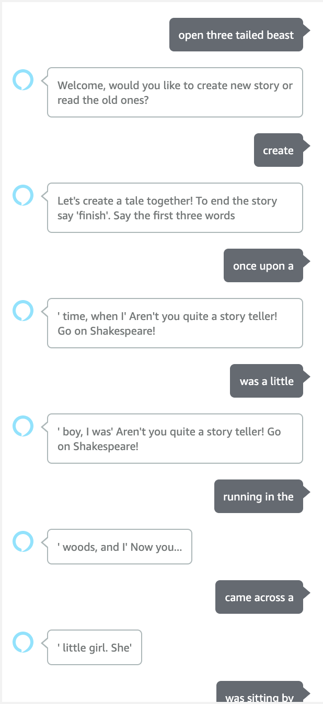
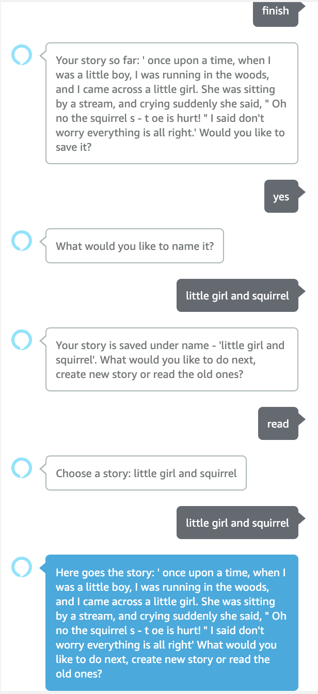

### Three Tailed Beast
DL based interactive Alexa skill. You create a story with Alexa by taking turns and saying three words on each turn.

### Alexa examples
|:---:|:---:|
| | |

### Alexa skill instructions
* Create s3 bucket and replace BUCKET_NAME in `constants.py` with your bucket name.
* Replace API_URL with droplet IP or ngrok domain

### Run API locally
After you have cloned the repository, install the dependencies with pip

`pip install -r requirements.txt`

Run application with

`uvicorn api.main:app`

Host api with ngrok

### Run API on Digital Ocean
1. Install terraform 
2. Go to the terraform directory in the project
3. Create `terraform.tfvars` file and initialize all the variables present in the `variables.tf` (`terraform.tfvars.example` included)
4. Run `terraform init` 
5. To see what changes the script will make to the cloud run `terraform plan`
6. To execute the script run `terraform apply`
7. To remove all the resources which where created run `terraform destroy`

### Authors:
* Nino Basilaia ninucabas@gmail.com
* Somesh Khandelia  someshkhandelia@gmail.com
