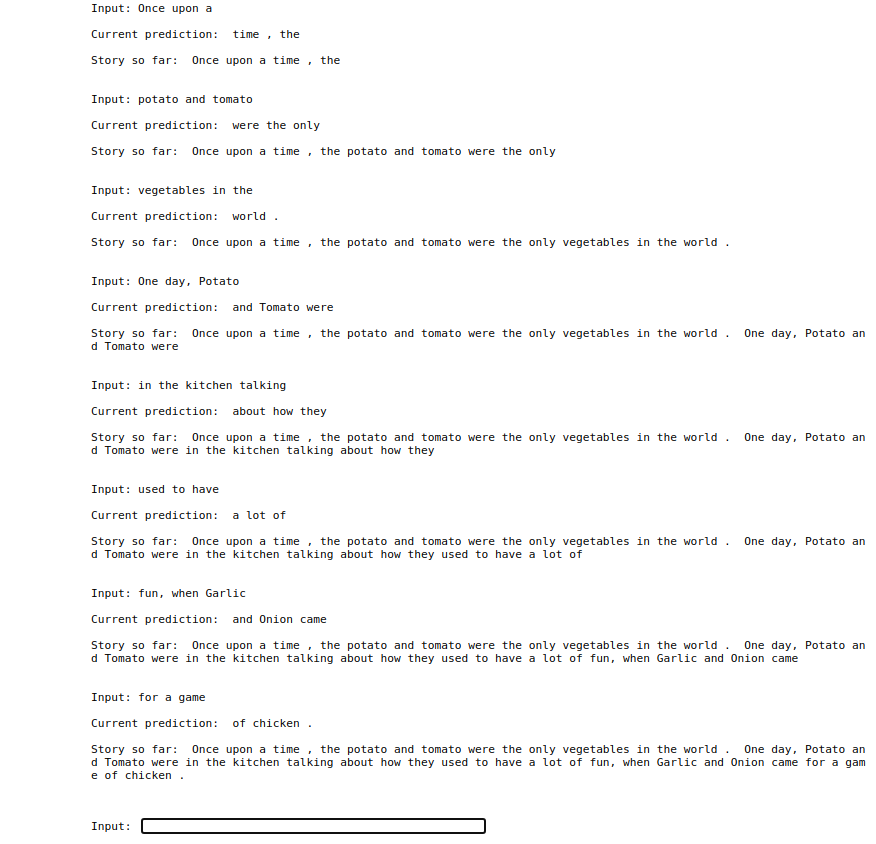

## Three Tailed Beast
This is a fun and interactive Alexa skill. The name is derived from a popular anime called [Naruto](https://en.wikipedia.org/wiki/Naruto), because both authors are huge anime fans. More importantly, Alexa helps you to write a nice story by taking turns, whereby in each turn the user is supposed to say exactly **three words**. Then Alexa attempts a meaningful continuation of the user's words, keeping in mind the story so far. This cycle goes on unil the user says *finish*. Thus, the user obtains a nice tale (read **tail**) generated using Deep Learning, which he can also save and ask Alexa to read for him later.

### Example
We derived our inspiration for this skill from a talk show interview on [YouTube](https://youtu.be/DCataNWjw-Q).

  
  
  

## The Deep Learning and NLP behind the scenes

### The LSTM model
To accomplish something so nice, it's fairly obvious that a powerful model was needed. While we tried to obtain results with **LSTM** based models, since they are supposed to be good with sequences and can hold the context over a long sequence, we were disappointed with the outcome. The model gave mostly repetitive predictions. Also, it was fairly difficult to train the model, since it would take quite long for even a single epoch of training (we used the **Project Gutenberg books** dataset, which has more than 50,000 books. However, even attempting to train on just a few books proved futile). Thus we decided to move to a pre-trained model, the **GPT-2**.

### The GPT-2 model
The [Pytorch Transformers](https://pytorch.org/hub/huggingface_pytorch-transformers/) library offers a wide array of powerful transformer based models, and we decided to use the GPT-2 since it's considered state-of-the-art. We first used the small version of the model, which gave us decent results. However, we soon shifted to the medium version, when while testing we found that it was giving more reasonable predictions at a non-noticeable delay.

### Example
The idea was to predict the next three words. However, even a powerful model like this one suffered from repetitions at times, and then we had to tackle those situations by having multiple predictions out of which we chose a non-repetitive one, and if this was not possible in some cases, we had to truncate the prediction to a smaller number of words.

  

## How to use it ?
### Preliminary instructions
All you need to do is update following constant variable in `constants.py`
* Create s3 bucket and replace `BUCKET_NAME` with your bucket name.
* Replace `API_URL` with droplet IP or ngrok domain

### Run API locally
After you have cloned the repository, install the dependencies with pip

`pip install -r requirements.txt`

Run application with

`uvicorn api.main:app`

Host api with ngrok

### Run API on Digital Ocean
1. Install terraform 
2. Go to the terraform directory in the project
3. Create `terraform.tfvars` file and initialize all the variables present in the `variables.tf` (`terraform.tfvars.example` included)
4. Run `terraform init` 
5. To see what changes the script will make to the cloud run `terraform plan`
6. To execute the script run `terraform apply`
7. To remove all the resources which where created run `terraform destroy`

## Authors:
* Nino Basilaia ninucabas@gmail.com
* Somesh Khandelia  someshkhandelia@gmail.com
