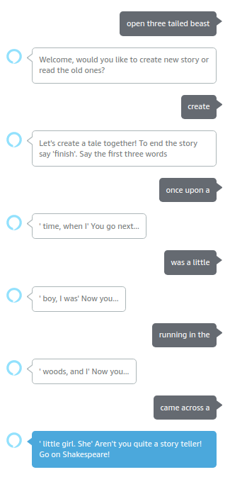
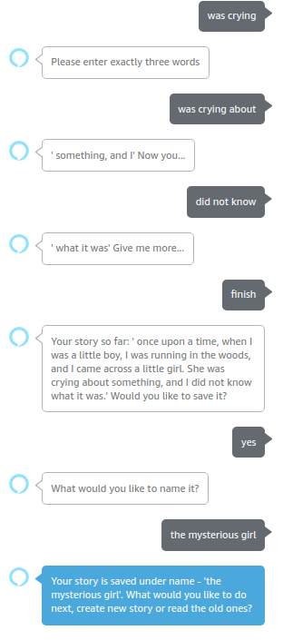
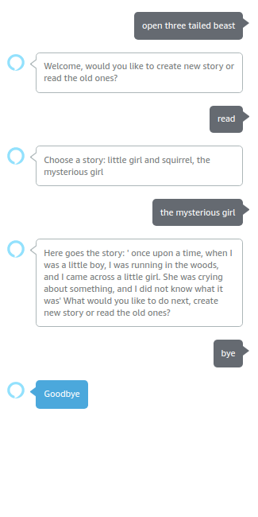

### Three Tailed Beast
Fun, interactive, intelligent, DL based Alexa skill. Alexa helps you to write a story by taking turns and saying three words on each turn. She gives you creative continuations for the sentences and in the end you get a nice small tales, which you can save and tell alexa to read it to you later.

### Alexa examples

  
  
  

### Alexa skill instructions
All you need to do is update following constant variable in `constants.py`
* Create s3 bucket and replace `BUCKET_NAME` with your bucket name.
* Replace `API_URL` with droplet IP or ngrok domain

### Run API locally
After you have cloned the repository, install the dependencies with pip

`pip install -r requirements.txt`

Run application with

`uvicorn api.main:app`

Host api with ngrok

### Run API on Digital Ocean
1. Install terraform 
2. Go to the terraform directory in the project
3. Create `terraform.tfvars` file and initialize all the variables present in the `variables.tf` (`terraform.tfvars.example` included)
4. Run `terraform init` 
5. To see what changes the script will make to the cloud run `terraform plan`
6. To execute the script run `terraform apply`
7. To remove all the resources which where created run `terraform destroy`

### Authors:
* Nino Basilaia ninucabas@gmail.com
* Somesh Khandelia  someshkhandelia@gmail.com
